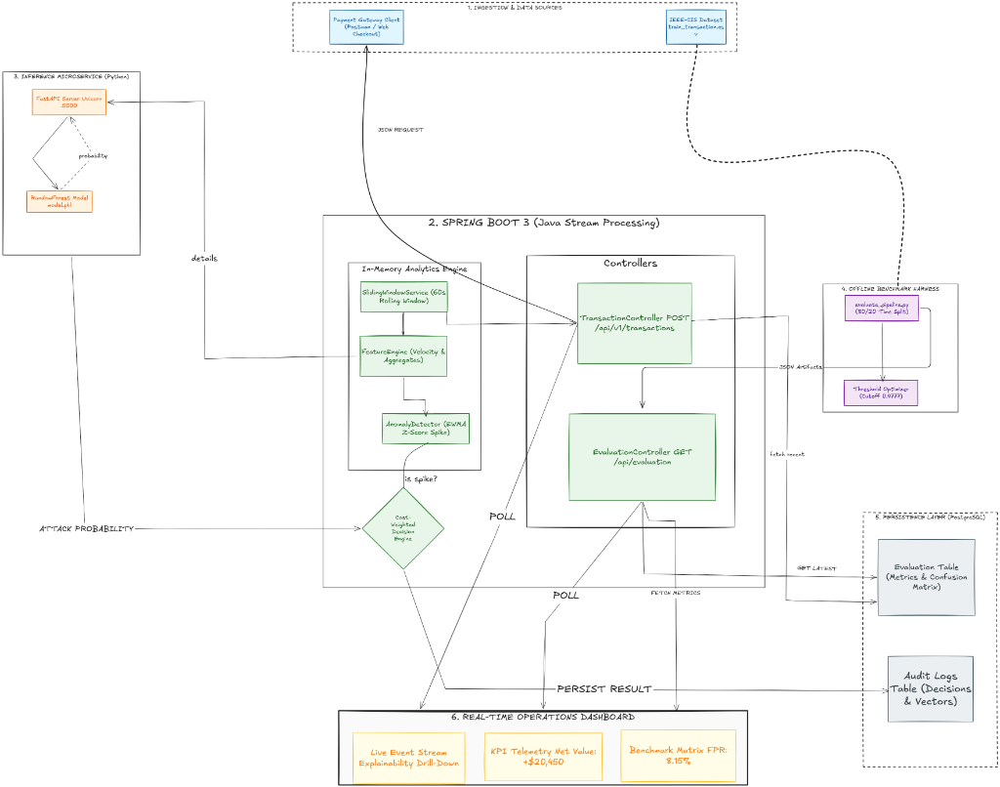

# FraudSpikeDetector

> **Real-Time Anomaly & Cost-Weighted Fraud Decision Engine**  
> Combines sub-20ms streaming velocity windows with statistical EWMA spike detection, Scikit-Learn inference, and honest cost-weighted economics on the IEEE-CIS benchmark.

---

## 🏛 System Architecture



---

## ⚡ The Gist (How It Works)

1. **Ingestion & Velocity Engine (Spring Boot 3 - Java)**
   * Receives payment requests via `POST /api/v1/transactions`.
   * Computes rolling **60-second in-memory sliding windows** per card/entity (`transactionCount`, `declineRate`, `uniqueIps`, `uniqueDevices`, `averageAmount`).
   * Evaluates sudden velocity bursts using an **EWMA Z-score anomaly detector** ($Z > 2.0$) to detect coordinated bot & card-testing spikes.

2. **ML Inference Microservice (FastAPI - Python)**
   * Scores extracted transaction & velocity feature vectors with a Scikit-Learn `RandomForestClassifier` running on Uvicorn (Port 5000).
   * Returns calibrated `attackProbability` (0.00 – 1.00) in under 5ms.

3. **Cost-Weighted Decision Engine**
   * Translates scores into three operational states based on economic risk thresholds:
     * **`APPROVE`** ($< 0.4777$): Genuine user traffic passed with zero friction.
     * **`SUSPICIOUS`** ($\ge 0.4777$): Flagged for friction/review; optimal economic threshold.
     * **`INSPECT`** (Spike detected & $\ge 0.7999$): High-confidence coordinated attack.
   * Every decision and feature vector is written to PostgreSQL (`audit_logs`).

4. **Honest Offline Evaluation Harness**
   * Evaluated on held-out IEEE-CIS Fraud data (590k transactions) using a **strict 80/20 time-based split** on `TransactionDT` (no future leakage).
   * Runs locally via `python ml/evaluate_pipeline.py --local --sample 10000`.
   * Automatically persists evaluation snapshots directly into PostgreSQL (`evaluation_runs`).

5. **Real-Time Operations Dashboard (Frontend)**
   * High-density dark mode telemetry interface (`frontend/`).
   * Polls Spring Boot (`GET /api/v1/transactions/recent` & `GET /api/evaluation/latest`).
   * Visualizes live payment events, real-time feature vector drill-downs, and threshold optimization curves without polluting live demo state.

---

## 📊 Key Evaluation Benchmark (IEEE-CIS 10k Held-Out Set)

| Metric | Audited Value | Note |
|---|---|---|
| **Recall** | **70.93%** | 244 out of 344 actual fraud events caught |
| **Precision** | **23.67%** | 7x lift over natural 3.44% baseline class imbalance |
| **False Positive Rate** | **8.15%** | Only 787 false reviews out of 9,656 legit transactions |
| **Cost Model** | **$50 FP vs $500 FN** | $50 support friction vs $500 avg fraud loss |
| **Net Value Generated** | **+$20,450.00** | Profit saved across 10,000 transactions at $\tau = 0.4777$ |

---

## 🚀 Quick Start

### 1. Python ML Service
```bash
uvicorn ml.fastapi_app:app --host 0.0.0.0 --port 5000
```

### 2. Spring Boot Core
```bash
cd backend/fraudDetector
./mvnw spring-boot:run
```

### 3. Real-Time Dashboard
Open `frontend/index.html` in your browser, or:
```bash
npx serve frontend -l 3000
```
